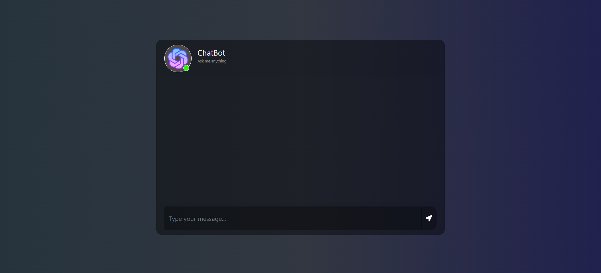

# ChatBot avec Microsoft DialoGPT-Medium

Bienvenue dans le projet **ChatBot** utilisant le modèle **DialoGPT-medium** de Microsoft ! Ce projet est une application web interactive développée avec **Flask** qui permet aux utilisateurs de discuter avec un chatbot alimenté par un modèle de langage pré-entraîné.

## Fonctionnalités

- **Interface utilisateur moderne** : Un chat en temps réel avec un design épuré et intuitif.
- **IA de conversation** : Alimentée par le modèle **DialoGPT-medium**, offrant des réponses engageantes et naturelles.
- **Personnalisation facile** : Modifie les réponses, le style ou même le modèle pour adapter l'application à tes besoins.

## Structure du Projet

Voici l'organisation des fichiers pour t'aider à naviguer dans le projet :

```bash
ChatBot-microsoft-DialoGPT-medium/
├── app.py                 # Script principal de l'application Flask
├── requirements.txt       # Liste des dépendances Python
├── README.md              # Ce fichier, pour décrire le projet
├── static/
│   └── style.css          # Feuille de style pour l'interface utilisateur
├── templates/
   └── template.html      # Template HTML pour l'affichage du chatbot
```

### Détails des fichiers :
- **app.py** : Contient la logique de l'application Flask ainsi que l'intégration avec le modèle DialoGPT.
- **style.css** : Personnalise le style du chat (modifie-le pour changer l’apparence de l’interface !).
- **template.html** : Le fichier HTML qui rend la page Web avec un formulaire pour l’utilisateur et un affichage des messages du chatbot.

## Pré-requis

Tu dois avoir installé **Python 3.x** sur ton système. Les bibliothèques nécessaires sont spécifiées dans le fichier `requirements.txt` :

```bash
pip install -r requirements.txt
```

### Principales bibliothèques :

- **Flask** : Framework web léger pour l'application.
- **torch** : Bibliothèque de calcul pour PyTorch, utilisée par le modèle DialoGPT.
- **transformers** : Bibliothèque de modèles de langage de Hugging Face.

## Installation

1. Clone le dépôt sur ton système local :

   ```bash
   git clone https://github.com/MOHAMED-EL-HADDIOUI/ChatBot-microsoft-DialoGPT-medium.git
   cd ChatBot-microsoft-DialoGPT-medium
   ```

2. Active ton environnement virtuel (si tu en utilises un) et installe les dépendances :

   ```bash
   pip install -r requirements.txt
   ```

3. Lance l'application Flask :

   ```bash
   python app.py
   ```

4. Accède au chatbot en ouvrant ton navigateur à l'adresse suivante :

   ```plaintext
   http://127.0.0.1:5000/
   ```

## Utilisation
- **Envoyer un message** : Tape ton message dans le champ de texte et clique sur le bouton "Envoyer".
- **Recevoir une réponse** : Le chatbot générera une réponse automatiquement basée sur le modèle DialoGPT.

## Personnalisation

Si tu souhaites expérimenter avec d'autres modèles ou améliorer la génération des réponses, tu peux facilement adapter le fichier `app.py` en changeant la ligne suivante pour charger un autre modèle :

```python
tokenizer = AutoTokenizer.from_pretrained("microsoft/DialoGPT-medium")
model = AutoModelForCausalLM.from_pretrained("microsoft/DialoGPT-medium")
```

Tu peux, par exemple, essayer d'autres modèles plus récents ou adaptés comme `microsoft/Phi-3-mini-4k-instruct`.

## Contribution

Si tu souhaites contribuer à ce projet, n'hésite pas à faire un **fork** du dépôt, à créer une nouvelle branche pour tes modifications, et à soumettre une **pull request**.

## Acknowledgements

- Ce projet utilise le modèle **DialoGPT-medium** développé par Microsoft et disponible via la plateforme [Hugging Face](https://huggingface.co/microsoft/DialoGPT-medium).
- Merci à la communauté open-source pour les outils et bibliothèques qui facilitent le développement d'applications AI comme celle-ci.

## Licence

Ce projet est sous licence MIT. Consulte le fichier [LICENSE](LICENSE) pour plus d'informations.
```

### Points d'interactivité ajoutés :
- **Personnalisation du projet** : Suggestions pour changer le style ou les modèles utilisés.
- **Structure du projet** : Explication des fichiers pour faciliter la navigation.
- **Suggestions pour essayer d'autres modèles** : Tu peux passer à un autre modèle pour améliorer les performances ou répondre à des besoins spécifiques.

Cela devrait rendre ton projet plus accessible et plus facile à comprendre pour toi et pour ceux qui y participeraient.